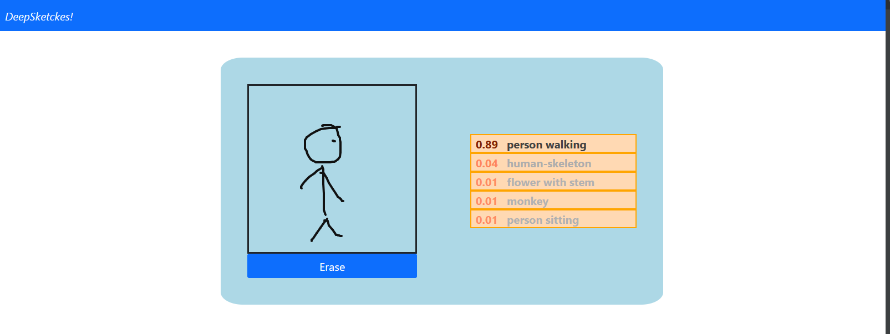

# DeepSketches!

Implementation and training of a Convolutional Neural Network to recognize sketched objects online, inspired by [this paper](https://www.researchgate.net/publication/282211796_DeepSketch_Deep_convolutional_neural_networks_for_sketch_recognition_and_similarity_search).

### Installation

> pip install -r requirements.txt

### Training
The CNN is trained on the [TU-Berlin dataset](http://cybertron.cg.tu-berlin.de/eitz/projects/classifysketch/) of sketches, which contains 20.000 annotated samples of 250 different sketched objects.

The already trained model can be found [here](https://drive.google.com/file/d/1sAYV6dVb4mgN45oESyZhJNYaEW-kPmqr/view?usp=sharing) as a keras SavedModel, which can be used directly for inference or trained further.

### Serving
The model is served through [FastAPI](https://fastapi.tiangolo.com/). To launch the server:
> uvicorn webapp:app

